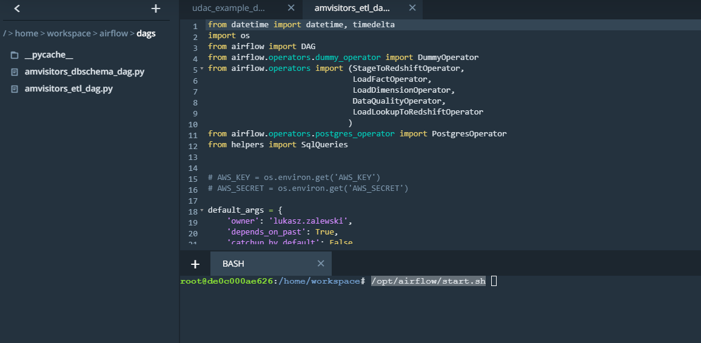
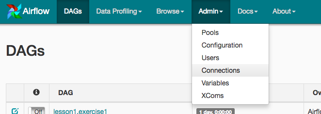
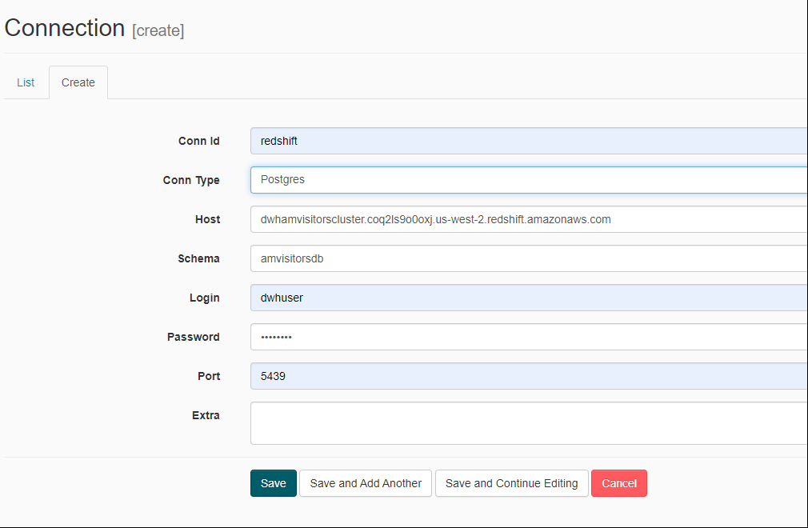
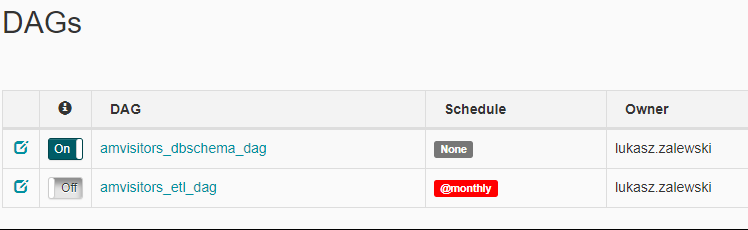
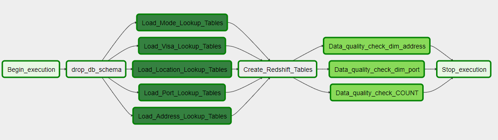
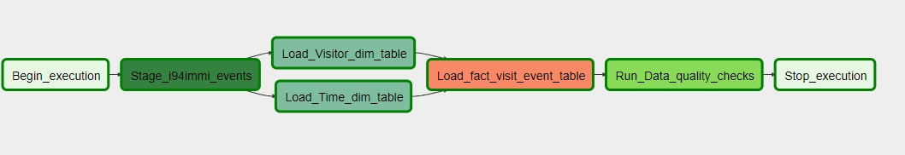
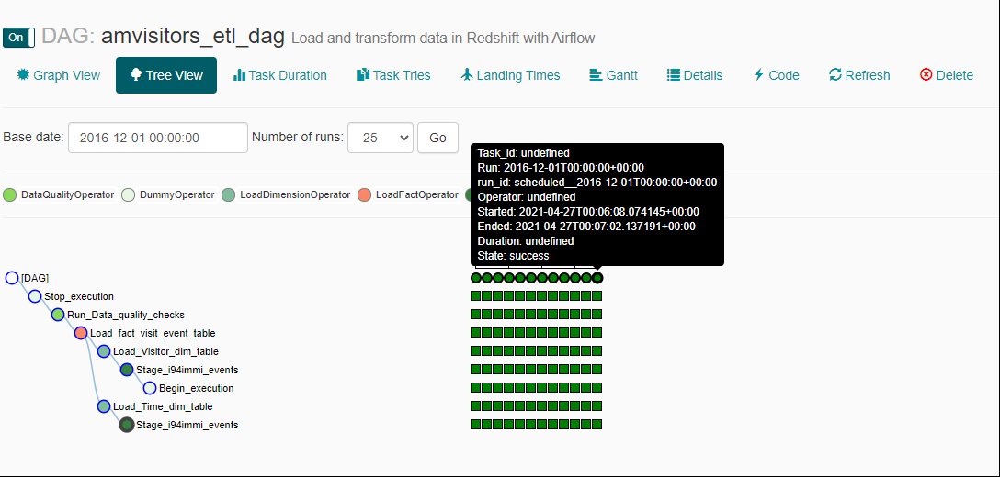
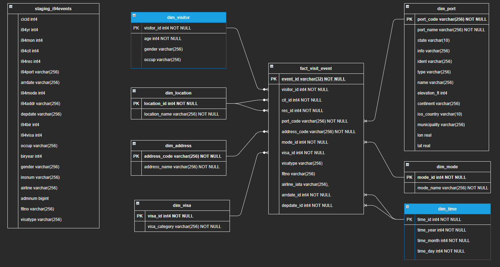

# American Visitors

Udacity Data Engineering Capstone Project  

---

## 1. Description
In this project, where the main goal was to combine what I've learned
throughout the program I decided to use datasets included in the Project Workspace. 
I decided to concentrate on two datasets:
- **I94 Immigration Data**: This data comes from the US National Tourism and Trade Office.
[Data source](https://travel.trade.gov/research/reports/i94/historical/2016.html)  
  I wanted to deal with the processing of a larger set of data provided by Udacity
  in `../../data/18-83510-I94-Data-2016/` location of Project Workspace.
- **Airport Code Table** - simple table of airport codes and corresponding cities.
  Data cames from [this location](https://datahub.io/core/airport-codes#data)
  and available in `airport-codes_csv.csv` file.  
  
additionaly I touch a little **U.S. City Demographic Data** but in case of possible way
of extending information in target DWH.  

**Project scope**: The main dataset includes data on immigration to the United State. Within this project I transform dataset from SAS format using Spark process and then in Airflow I transforming partitioned and cleaned data from AWS S3 to Redshift Data Warehouse (DWH) for further Business Intelligence analysis.

**Use Cases**:  
Final solution in AWS Redshift DWH shall allow to answer for example questions:

- What are most visited US states for visitors?
- How many people visit US in 2016 each month on a business visa?  
- How many days in average each visitor stayed in US in each month?  


**Project** is devided on two *subprojects*:  

- **Jupyter Notebook** where I follow:
  - (Step 1) - Identifing and gathering the data  
  - (Step 2) - Exploring and Assessing the Data  
   In this subproject I use Spark inside Udacity Project Workspace to process I94imigration data
    and finally store results in AWS S3 bucket for further processing using Airflow.    
   More info in `Capstone Project TemplateFinal.ipynb` file.
- **Airflow** where:
  - (Step 3) - Data Model is define and implemented 
  - (Step 4) - ETL process is implemented   
    In this subproject AWS Redshift and Airflow is used.  
    More description provided in **Airflow** section below.

    
## 2. Airflow
### 2.1 How to prepare and run this subproject
For this task I propose to use DWH implementation based on AWS Redshift.
It allows further access for many users (100+) and nice data exploration.
Together with Airflow it is good solution for countiouse ETL pipeline proces.   

### 2.2 AWS Redshift
1. First, edit `dwh.cfg` file. Fill in AWS acces key (KEY) and secret (SECRET).
Rest of fields was provided as example. It could be change base on any further needs.
2. Prepare AWS Environment with Redshift and proper IAM role to access S3 bucket.
- to create AWS Redshift Cluster please run `python aws_env.py -c`
- if you want to delete AWS Redshift Cluster please run `python aws_env.py -d`

### 2.3 Airflow run
In case of this project I decided to use Airflow Project Workspace provided
by Udacity. To run this project (after moving project files to Project Workspace)
please run following command:`/opt/airflow/start.sh`  


### 2.4 Airflow UI
1. Prepare Airflow's UI to configure your AWS credentials and connection to Redshift.
   * You can use the Project Workspace (from Udacity) and click on the blue Access Airflow button in the bottom right.
   * If you'd prefer to run Airflow locally, open http://localhost:8080 in Google Chrome (other browsers occasionally have issues rendering the Airflow UI). 
2. Create proper Connection in Admin tab
   
   
3. On the create connection page, enter the following values:
- Conn Id: Enter aws_credentials.
- Conn Type: Enter Amazon Web Services.
- Login: Enter your Access key ID from the IAM User credentials.
- Password: Enter your Secret access key from the IAM User credentials.
  
Once you've entered these values, select Save and Add Another.
  
4. On the next create connection page, enter the following values:
- Conn Id: Enter redshift.  
- Conn Type: Enter Postgres.  
- Host: Enter the endpoint of your Redshift cluster, excluding the port at the end.  
- Schema: Enter dev. This is the Redshift database you want to connect to.  
- Login: Enter awsuser.  
- Password: Enter the password you created when launching your Redshift cluster.  
- Port: Enter 5439.  
  
Once you've entered these values, select Save.

### 2.5 AMVisitors DAGs  
For the purpose of this project I have prepared two DAGs:  

  
- **amvisitors_dbschema_dag** - DAG (without schedule) for DB schema initializatin and lookup dimensions Tables filling  
    
  This DAG should by start manualy, each time when there is a need to clean environment
  and DB dimension 'lookup table' recreation 
- **amvisitors_etl_dag** - DAG for processing i94 Imigration data events data @mounthly  
    
  To start the DAG please switch state from OFF to ON.
  After Refresing in Tree View of *amvisitors_etl_dag* status of catching up should be visible.  
    


### 2.6 Data Quality Checks  

Simple Quality Checks were implemented as part of DAGs in Airflow pipeline on two stages:
- after DB Schema creation and Lookup data load
- each time DAG is run every month (including catchup process) simple count of adding records are checked.  

As example of correct values check after Lookup data load I added two tasks:
``` python
run_quality_check_dim_port = DataQualityOperator(
    task_id='Data_quality_check_dim_port',
    dag=dag,
    redshift_conn_id="redshift",
    test_sql = "select lon,lat from dim_port where port_code = 'HOM'",
    test_result = (-151.477,59.6456,)
)


run_quality_check_dim_address = DataQualityOperator(
    task_id='Data_quality_check_dim_address',
    dag=dag,
    redshift_conn_id="redshift",
    test_sql = "select address_name from dim_address where address_code = 'FL'",
    test_result = ('FLORIDA',)
)

```

In production system Quality Check shall be more sophisticated.

### 2.7 Main files
The project template includes four files:

- `dwh.cfg` main configuration file
- `aws_env.py` is where AWSEnv class was implemented to simplify AWS Redshift Cluster creation
```  
└───airflow                      # Airflow home
|   |               
│   └───dags                     
│   |   │ amvisitors_dbschema_dag.py      # DAG for DB schema creation and lookup table filling
|   |   | amvisitors_etl_dag.py           # Main DAG definition
|   └───plugins
│       │  
|       └───helpers
|       |   | sql_queries.py     # All sql queries needed for AMVisitorsDB creation and ETL process
|       |
|       └───operators
|       |   | data_quality.py    # DataQualityOperator
|       |   | load_dimension.py  # LoadDimensionOperator
|       |   | load_fact.py       # LoadFactOperator
|       |   | load_lookup.py     # LoadLookupToRedshiftOperator
|       |   | stage_redshift.py  # StageToRedshiftOperator
```

## 3. Database Schema (result of Step 3)
Based on Data Exploration and Identification in `Capstone Project TemplateFinal.ipynb` 
I have proposed following Start DB Schema.



Why did you choose the model you chose?
Benefits of Star Schema:
* Star schemas are easy for end users and applications to understand and navigate.
* Query performance
* Load performance and administration
* Built-in referential integrity
* Easily understood:

REMARKS:  
1. Becasue and nature of static SAS data description I decided to assume that following
   dimensions tables \[`dim_port`,`dim_mode`,`dim_location`,`dim_address`,`dim_visa`\]
   will be filled ones and during normal ETL process will not be updated.
   
2. Because of AWS RedShift does not enforce constraints [link](https://docs.aws.amazon.com/redshift/latest/dg/r_CREATE_TABLE_NEW.html)
   there was need to use additional `WHERE <pk_column> NOT IN` clause in `sql_queries.py` for
   [`dim_visitor_insert`,`dim_arrdate_time_insert`,`dim_depdate_time_insert`] SQL's.
   

## 4. Project Summary and additional topics (Step 5).  
For the purpose of this project I have used:
- Jupyter Environment
- ETL: Python, Pandas, Pyspark
- Data Warehouse: AWS Redshift
- Data Pinelines: Apache Airflow
- Storage: AWS S3

**How often the data should be updated and why?**

I think that nowadays data shall be process as soon as possible, event in near real-time
but it depends on data collection and transformation from third party data sourcess.  

In case of this project and I94 Imigration data - the visitors in each port arrive in and departure at anytime. In production system I think data could be collected with day or even minute precision. It would be efficient to run ETL process hourly or daily.

**What IF?:**
- If the data was increased by 100x.  
  If Redshift DB will be not enought or will be to costly I will considert to use any
  sharding DB solution (SQL or event NoSQL) with horizontal scaling.  
  
- If the pipelines were run on a daily basis by 7am.  
  The Airflow scheduler monitors all tasks and all DAGs, and triggers the task instances
  whose dependencies have been met.  
  
- If the database needed to be accessed by 100+ people.  
  If we use AWS Redshift there is possible to increase any quatas and limites.  
  Plese take a look on [this](https://docs.aws.amazon.com/redshift/latest/mgmt/amazon-redshift-limits.html) 


## License
[MIT](https://choosealicense.com/licenses/mit/) and Udacity Students license :).
