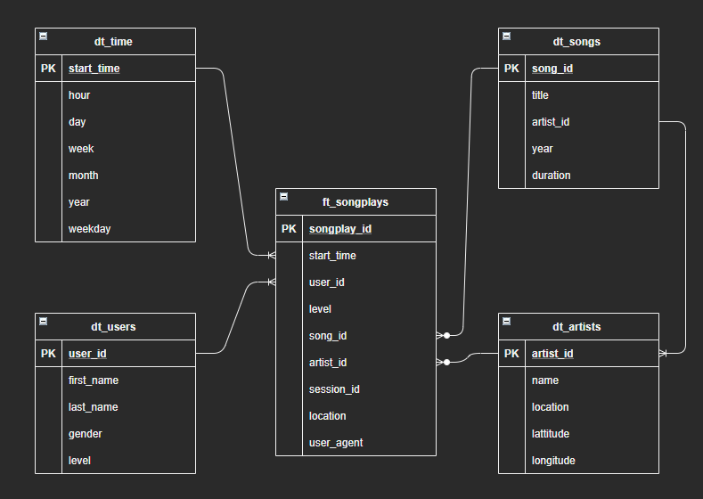
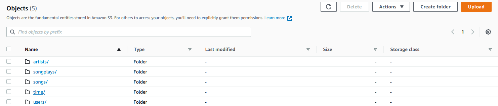

# Project4 - Sparkify datasets ETL processing using Spark

Demo project based on Local Spark and AWS EMR Spark Environment.

---

## Description
In this project, I present simple implementation of datalake on AWS with ETL pipeline hosted on EMR (Spark + Hadoop)
After analysis of sample of Song and Logs Dataset, base on provided template I have prepare target DB Schema which was use as blueprint to process the data into analytics tables using Spark, and load them back into S3.

Two datasets are used:  
1. A song dataset, which is a subset of real data from the [Million Song Dataset](http://millionsongdataset.com/).
2. A log dataset, which consists of log files in JSON format generated by this [event simulator](https://github.com/Interana/eventsim) based on the songs in the dataset above.

The files are stored in S3 bucket `s3a://udacity-dend` and are ingested into fact and dimension tables that are written as parquet file at location `s3://lzalewsk-emr-bck/sparkify/`

Fact Table:

    songplays - records in event data associated with song plays i.e. records with page NextSong
        songplay_id, start_time, user_id, level, song_id, artist_id, session_id, location, user_agent

Dimension Tables:

    users - users in the app
        user_id, first_name, last_name, gender, level
    songs - songs in music database
        song_id, title, artist_id, year, duration
    artists - artists in music database
        artist_id, name, location, lattitude, longitude
    time - timestamps of records in songplays broken down into specific units
        start_time, hour, day, week, month, year, weekday


## How to run project

### Running the Pipeline in local mode in JupyterLab from Udacity  
1. Please extract *.zip files in local `data/` folder. Please be shure that `log_data` are located in `data/2018/11` subdirecotry.
2. Please run:
    `python etl.py --local`

### Running The Pipeline in EMR
1. First, edit `dl.cfg` file. Fill in AWS acces key (KEY) and secret (SECRET).  
Rest of fields was provided as example. It could be change base on any further needs.
2. Please run:
    `python aws_env.py -c`  
    
NOTE: Python script will create EMR Spark Environment. Before starting Spark local `etl.py` file will be uploaded to S3 bucket (please check SCRIPT_URI in `dl.cfg`). After starting EMR Spark Cluster following steps will be automaticly run:  
```
 Steps=[
                   ...
                    {
                        'Name': 'Setup - copy files',
                        'ActionOnFailure': 'CANCEL_AND_WAIT',
                        'HadoopJarStep': {
                            'Jar': 'command-runner.jar',
                            'Args': ['aws', 's3', 'cp', 's3://lzalewsk-emr-scripts', '/tmp/',
                                     '--recursive']
                        }
                    },
                    {
                        'Name': 'Run PySpark ETL',
                        'ActionOnFailure': 'CANCEL_AND_WAIT',
                        'HadoopJarStep': {
                            'Jar': 'command-runner.jar',
                            'Args': ["spark-submit", "/tmp/etl.py", "--emr"]
                        }
                    }
```
`etl.py` python script will start with `--emr` option.

3. `aws_enr.py` script will terminate when all steps will be finished.  
4. REMEBER TO TERMINATE EMR Cluster  
`python aws_env.py -t <Cluster_id>`


## Main files
The project template includes four files:

- `dl.cfg` main configuration file
- `aws_env.py` is where AWSEnv class was implemented to simplify AWS EMR Cluster creation and termination
- `etl.py` is ETL process for local Spark Environment and also for EMR Spart. Finaly further data for analysis are stored in S3 in parquet format.

## Database Schema
For further analytics use cases following Facts and Dimensions tables are proposed:  

Tables are soterd in parquet format in S3 bucket. In my case on `s3://lzalewsk-emr-bck/sparkify/`  




## License
[MIT](https://choosealicense.com/licenses/mit/) and Udacity Sudents license :).

## Project status
First release.