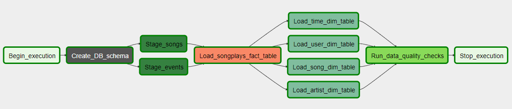
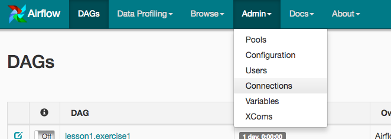
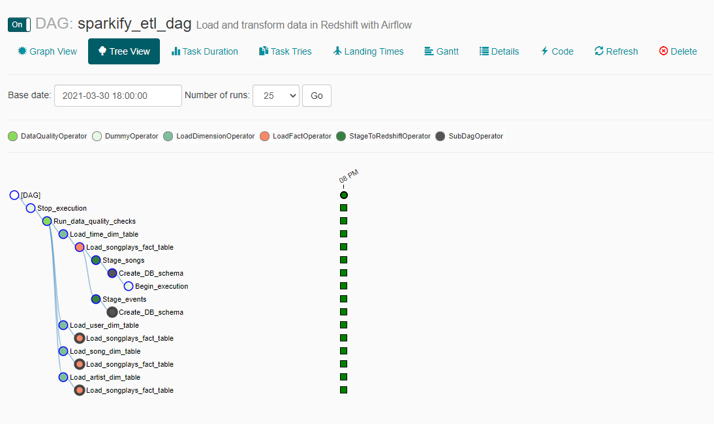
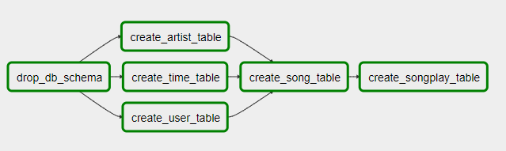

# Project 5 - Data Pipelines

Data Pipelines with Airflow

---

## Description
In this project, I present implementation automation and monitoring 
ETL pipelines using Airflow and AWS Redshift. 
Base on provided template I have prepare DB Schema and ETL pipeline 
that extracts their data from S3, stages them in Redshift, and transforms data into a set of dimensional tables.

The source data resides in S3 and needs to be processed in Sparkify's data warehouse in Amazon Redshift. 
The source datasets consist of JSON logs that tell about user activity
in the application and JSON metadata about the songs the users listen to.

Within this project following DAG in Airflow was implemented.


## How to run project
### Redshift DB (based on Project 3)
1. First, edit `dwh.cfg` file. Fill in AWS acces key (KEY) and secret (SECRET).
Rest of fields was provided as example. It could be change base on any further needs.
2. Prepare AWS Environment with Redshift and proper IAM role to access S3 bucket.
- to create AWS Redshift Cluster please run `python aws_env.py -c`
- if you want to delete AWS Redshift Cluster please run `python aws_env.py -d`

### Airflow UI
1. Prepare Airflow's UI to configure your AWS credentials and connection to Redshift.
   * You can use the Project Workspace (from Udacity) and click on the blue Access Airflow button in the bottom right.
   * If you'd prefer to run Airflow locally, open http://localhost:8080 in Google Chrome (other browsers occasionally have issues rendering the Airflow UI). 
2. Create proper Connection in Admin tab
   
   
3. On the create connection page, enter the following values:
- Conn Id: Enter aws_credentials.
- Conn Type: Enter Amazon Web Services.
- Login: Enter your Access key ID from the IAM User credentials.
- Password: Enter your Secret access key from the IAM User credentials.

Once you've entered these values, select Save and Add Another.
  
4. On the next create connection page, enter the following values:
- Conn Id: Enter redshift.
- Conn Type: Enter Postgres.
- Host: Enter the endpoint of your Redshift cluster, excluding the port at the end.
- Schema: Enter dev. This is the Redshift database you want to connect to.
- Login: Enter awsuser.
- Password: Enter the password you created when launching your Redshift cluster.
- Port: Enter 5439.

Once you've entered these values, select Save.
  
### Start the DAG
Start the DAG by switching it state from OFF to ON.  
Refresh the page and click on the *sparkify_etl_dag* to view the current state.



## Main files
The project template includes four files:

- `dwh.cfg` main configuration file
- `aws_env.py` is where AWSEnv class was implemented to simplify AWS Redshift Cluster creation
```  
└───airflow                      # Airflow home
|   |               
│   └───dags                     
│   |   │ sparkify_etl_dag.py      # Main DAG definition
|   |   | schema_creator_subdug.py # subDAG for DB schema creation
|   └───plugins
│       │  
|       └───helpers
|       |   | sql_queries.py     # All sql queries needed
|       |
|       └───operators
|       |   | data_quality.py    # DataQualityOperator
|       |   | load_dimension.py  # LoadDimensionOperator
|       |   | load_fact.py       # LoadFactOperator
|       |   | stage_redshift.py  # StageToRedshiftOperator
```

## Database Schema
DB Schema was prepared based on `create_tables.sql` file.
PLEASE NOTE THAT (compering to Project 3) for this project NO TABLE RELATION WAS DEFINED.
As preparation to implement table relation following DB Schema Creation Task
as a SubDAG was prepared.



## License
[MIT](https://choosealicense.com/licenses/mit/) and Udacity Sudents license :).

## Project status
First release.