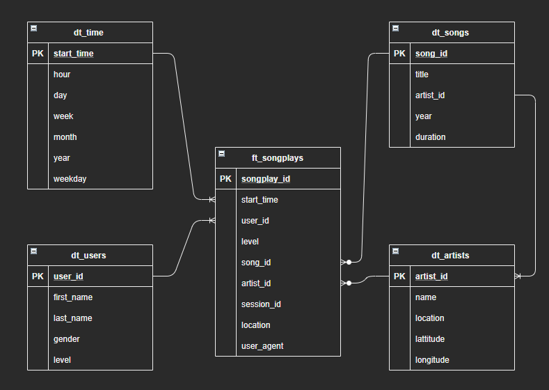

# Project 3 - Sparkify AWS ETL

AWS ETL Demo project

---

## Description
In this project, I present simple implementation of data warehouse on AWS to build an ETL pipeline for a database hosted on Redshift.
After analysis of sample of Song and Logs Dataset, base on provided template I have prepare DB Schema and ETL pipeline that extracts their data from S3, stages them in Redshift, and transforms data into a set of dimensional tables.

## How to run project
1. First, edit `dwh.cfg` file. Fill in AWS acces key (KEY) and secret (SECRET).
Rest of fields was provided as example. It could be change base on any further needs.
2. Prepare AWS Environment with Redshift and proper IAM role to access S3 bucket. 
(If you are using Jupyter, skip this and go to 3)
- to create AWS Redshift Cluster please run `python aws_env.py -c`
- if you want to delete AWS Redshift Cluster please run `python aws_env.py -d`
3. If you are using Jupyter, you may open `DWH_project.ipynb` file and run each stage of Process.  
In other case to create proper tables and run ETL process please run
- `python create_tables.py` to create the tables in AWS Redshift  
- `python etl.py` to process all the input data to the DB  

## Main files
The project template includes four files:

- `dwh.cfg` main configuration file
- `aws_env.py` is where AWSEnv class was implemented to simplify AWS Redshift Cluster creation
- `create_table.py` is where fact and dimension tables for the star schema in Redshift are created
- `etl.py` is ETL process of loding data from S3 into staging tables on Redshift and then process that data into your analytics tables on Redshift
- `sql_queries.py` is where I define SQL statements. Because of relationship between tables I had change the table creation and deletion order.

## Database Schema
Base on songs and log dataseet following 2 staging tables are proposed.
Staging tables relates 1:1 to JSON songs and logs data content:  
  

For further analytics use cases following Facts and Dimensions tables are proposed:  

## Queries examples  
Please take a look into `DWH_project.ipynb` where some SQL Queries testing and optimization of key distribution key were provided. At this moment I do not know what could the final ammount of log data volume. Depending on most used queries and data nature distribution keys strategy could be diferent and still there is a space for optimization.

## License
[MIT](https://choosealicense.com/licenses/mit/) and Udacity Sudents license :).

## Project status
Secend release after review and feedback.